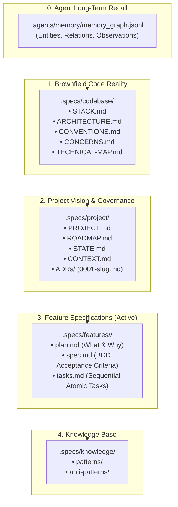
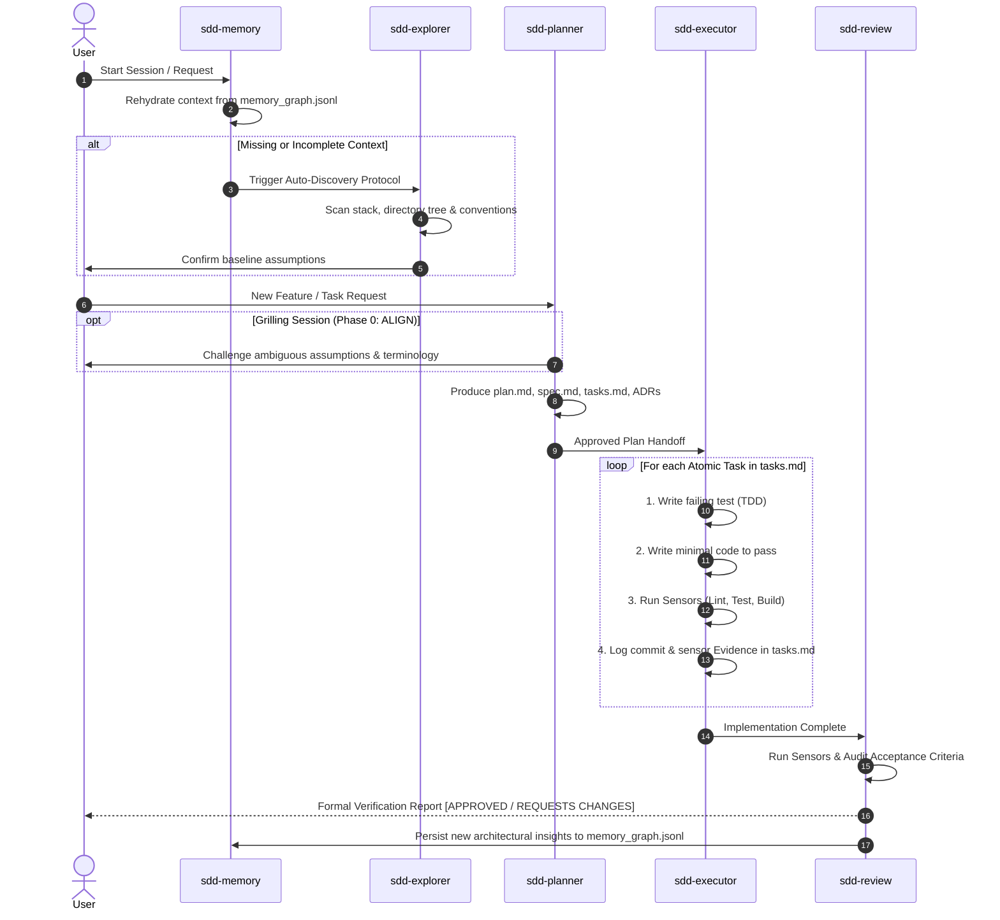

# AI-SDD Framework

> **Spec Driven Development (SDD) Lifecycle, Governance & Skill Runtime for AI Agents**

[](https://opensource.org/licenses/MIT)
[](#architecture--artifact-topology)
[](#the-sdd-lifecycle-protocol)
[](DESIGN.md)

---

## 🎯 Overview

**AI-SDD Framework** is an enterprise-grade agentic operating system and governance standard designed to eliminate the fundamental failure modes of AI coding assistants: hallucinated architectures, unverified assumptions, silent code simplification, broken test suites, and drift across multi-turn sessions.

Instead of unconstrained "prompt-and-code" execution, the framework enforces a **strict, deterministic Spec Driven Development lifecycle**:

```
0. sdd-memory   ──► 1. sdd-explorer ──► 2. sdd-planner ──► 3. sdd-executor ──► 4. sdd-review
(Cross-Session)     (Brownfield Reality) (Specs & ADRs)     (Atomic TDD Cycle)   (Sensor Audit)
```

---

## 🏛️ Architecture & Artifact Topology

The framework enforces a strict 4-layer partitioning model to guarantee single source of truth across sessions:



---

## 🌐 Universal Multi-Harness Compatibility (Rule Bridges)

AI-SDD Framework is 100% harness-agnostic. `AGENTS.md` and `.agents/rules/` serve as the **Single Source of Truth**, while lightweight **Rule Bridges** adapt the governance to every major AI coding assistant:

| Harness / Tool | Bridge File | Integration Mode |
| :--- | :--- | :--- |
| **Antigravity (Google AGY)** | `AGENTS.md` & `.agents/` | Native Core |
| **Claude Code (Anthropic)** | `CLAUDE.md` | Auto-loaded session context |
| **Cursor IDE** | `.cursorrules` & `.cursor/rules/sdd.mdc` | Project rules injection |
| **Windsurf / Cascade** | `.windsurfrules` | Cascade system rules |
| **Cline & Roo Code** | `.clinerules` | Agent prompt envelope |
| **GitHub Copilot** | `.github/copilot-instructions.md` | Copilot Workspace & Chat |
| **Aider Chat** | `.aider.conf.yml` | Auto `--read` flags |
| **Kimi CLI (Moonshot)** | `KIMI.md` | Project-level instructions |
| **Goose CLI (Block)** | `.goosehints` | Context hints |
| **OpenHands (OpenDevin)** | `.openhands_instructions` | Execution environment rules |
| **Continue.dev** | `.continue/rules.md` | Assistant system rules |
| **JetBrains AI / Junie** | `.junierules` | IDE instructions |
| **Devin (Cognition)** | `.devin/instructions.md` | Repository onboarding context |

---

## 📁 Repository Structure

```
ai-sdd-framework/
├── .agents/
│   ├── memory/
│   │   └── memory_graph.jsonl          # Cross-session persistent knowledge graph
│   ├── rules/                          # Non-negotiable system rules (Highest Precedence)
│   │   ├── TIER1_PROHIBITIONS.md       # Prohibitions: No shortcuts, No destructive git, Sequential order
│   │   ├── QUALITY_ENFORCEMENT.md      # Test & hook bypass bans, scratchpad isolation
│   │   └── TOKEN_OPTIMIZATION.md       # Calibrated output verbosity per model tier
│   └── skills/                         # Specialized Agent Skills & Protocols (Open Format)
│       ├── sdd-memory/                 # Long-term recall & graph maintenance
│       ├── sdd-explorer/               # Codebase discovery & technical mapping
│       ├── sdd-planner/                # Problem decomposition, specs & ADR authoring
│       ├── sdd-executor/               # Atomic TDD implementation with sensor evidence
│       ├── sdd-review/                 # Sensor-based empirical verification & scoring
│       ├── grill-me/                   # Interactive decision tree stress-testing
│       ├── debug/                      # Root cause analysis & reproduction
│       ├── refactor/                   # Clean-code structural improvements
│       ├── search/                     # Targeted symbol, regex & pattern lookup
│       ├── arxiv/                      # Academic paper extraction & BibTeX generation
│       └── write-a-skill/              # Meta-skill for authoring new agent skills
├── .specs/                             # Living Specifications (Created per project)
│   ├── codebase/                       # Physical code architecture & stack maps
│   ├── project/                        # Product vision, session state & ADRs
│   ├── features/                       # Active feature specifications
│   └── knowledge/                      # Curated patterns and anti-patterns
├── .cursor/rules/sdd.mdc                # 🌉 Cursor MDC modern rule bridge
├── .devin/instructions.md              # 🌉 Devin instruction bridge
├── .github/copilot-instructions.md     # 🌉 GitHub Copilot rule bridge
├── .continue/rules.md                  # 🌉 Continue.dev rule bridge
├── .cursorrules                        # 🌉 Cursor rule bridge
├── .windsurfrules                      # 🌉 Windsurf rule bridge
├── .clinerules                         # 🌉 Cline / Roo Code rule bridge
├── .aider.conf.yml                     # 🌉 Aider configuration bridge
├── .goosehints                         # 🌉 Goose CLI bridge
├── .openhands_instructions             # 🌉 OpenHands bridge
├── .junierules                         # 🌉 JetBrains AI / Junie bridge
├── CLAUDE.md                           # 🌉 Claude Code bridge
├── KIMI.md                             # 🌉 Kimi CLI bridge
├── AGENTS.md                           # 🏛️ Master Operating Manual & Skill Routing Matrix
└── DESIGN.md                           # Linear-inspired Design Tokens & UI Specification
```

---

## 🔄 The SDD Lifecycle Protocol



---

## 🎛️ Complete Capabilities & Skill Routing Matrix

| Intent / Request Type | Primary Skill | Supporting Skills & Tools | Target Artifacts |
| :--- | :--- | :--- | :--- |
| **Cross-Session Memory** | `sdd-memory` | `view_file`, `replace_file_content` | `.agents/memory/memory_graph.jsonl` |
| **Codebase Mapping & Research** | `sdd-explorer` | `search`, `arxiv`, `read_url_content` | `.specs/codebase/` (`STACK.md`, `ARCHITECTURE.md`, `CONVENTIONS.md`, `TECHNICAL-MAP.md`) |
| **Feature Planning & Scoping** | `sdd-planner` | `grill-me` (Phase 0 Align) | `.specs/features/<id>/` (`plan.md`, `spec.md`, `tasks.md`), `.specs/project/ADRs/` |
| **Stress-testing Requirements** | `grill-me` | `ask_question`, `view_file` | Direct interactive interview → Feeds `sdd-planner` |
| **Feature Implementation (TDD)** | `sdd-executor` | `refactor`, `debug`, run sensors | Source code, test files, `tasks.md` (Evidence column) |
| **Bug Investigation / Diagnosis** | `debug` | `search`, `run_command` | Root cause analysis → Feeds `sdd-planner` if replan needed |
| **Code Restructuring / Clean Code** | `refactor` | `sdd-executor` | Source code with non-regression tests |
| **Specification & Quality Audit** | `sdd-review` | Test runner, linter, build sensors | Formal Verification Report with Verdict in chat |
| **UI / Frontend / Design System** | `sdd-executor` / `sdd-planner` | `DESIGN.md`, `view_file` | Source code matching `DESIGN.md` tokens |
| **Symbol & Pattern Lookup** | `search` | `grep_search`, `find_by_name` | Direct file:line references |
| **Scientific / Algorithmic Papers** | `arxiv` | `read_url_content`, curl | Paper summaries and BibTeX |
| **Skill Authoring & Extension** | `write-a-skill` | — | `.agents/skills/<skill-name>/SKILL.md` |

---

## 🛡️ Core Rules & Safety Valves

1. **Research Before Implementing (Never Guess)**:
   > *"Source X does Y at file:line, we do Z, the difference causes W"* is the mandatory threshold. Hypothesizing or blind trial-and-error is rejected.
2. **Zero Shortcuts & Stubs (Tier 1)**:
   `// TODO`, `// FIXME`, `/* stub */` or simplified mock algorithms are strictly prohibited. Response time is irrelevant — quality and correctness are absolute.
3. **Safety Valve Protocol**:
   If an implementation task touches >3 files unexpectedly or hits high-risk legacy boundaries, the executor immediately halts and requests replanning from `sdd-planner`.
4. **Governed Deletions**:
   Destructive git operations (`git reset --hard`, `git push -f`, branch deletions) and project file removals are strictly blocked without human authorization.
5. **Design System Invariance**:
   All frontend and UI components must strictly inherit tokens (colors, typography, spacing, border radii) from [`DESIGN.md`](DESIGN.md).

---

## 🚀 Quickstart: Bootstrapping a Project

### 1. Integrate into your workspace
Copy the `.agents/`, `AGENTS.md`, and `DESIGN.md` into the root of your project:

```bash
cp -r .agents/ AGENTS.md DESIGN.md /path/to/your/project/
```

### 2. Auto-Discovery Protocol
Start your AI session. The agent will execute the **Blocking Gate**:
1. Check `.agents/memory/memory_graph.jsonl` for past session memory.
2. If `.specs/project/CONTEXT.md` is empty or missing, it triggers **Auto-Discovery** (scans package manifests, directory trees, configs, and coding conventions).
3. Generates the initial codebase map in `.specs/codebase/` and confirms domain assumptions with you.

### 3. Build Features with SDD
Request a new feature:
```text
"Planeje a feature de autenticação JWT com refresh token seguindo o SDD."
```
The agent will execute:
1. `sdd-planner` → drafts `plan.md`, `spec.md` with BDD scenarios, and atomic `tasks.md`.
2. `sdd-executor` → implements sequentially via TDD, logging sensor evidence.
3. `sdd-review` → audits sensors and generates a formal Verification Report.

---

## 📄 License

This project is licensed under the [MIT License](LICENSE).
