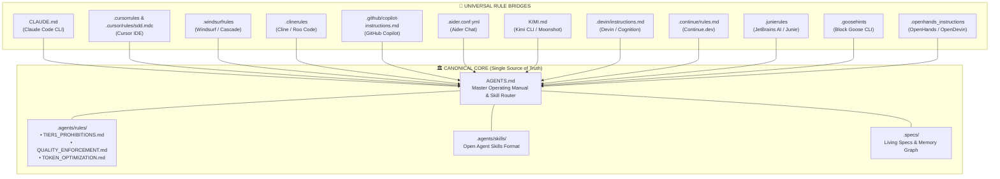
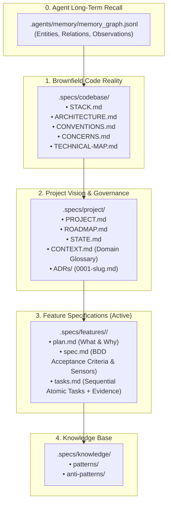
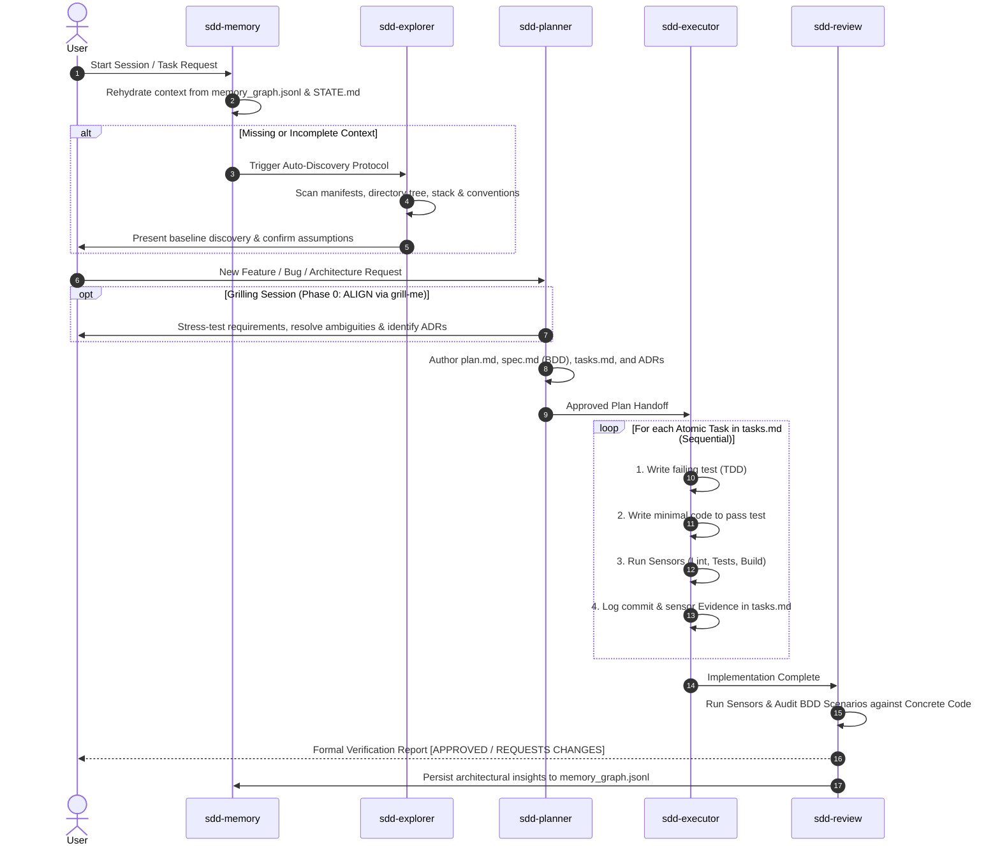

# AI-SDD Framework

> **Spec Driven Development (SDD) Lifecycle, Universal AI Agent Governance & Multi-Harness Skill Runtime**

[](https://opensource.org/licenses/MIT)
[](#-architecture--artifact-topology)
[](#-universal-multi-harness-compatibility-rule-bridges)
[](#-the-sdd-lifecycle-protocol)
[](DESIGN.md)

---

## 🎯 Overview

**AI-SDD Framework** is an enterprise-grade agentic operating system and governance standard designed to eliminate the fundamental failure modes of AI coding assistants:
- ❌ Hallucinated architectures and broken dependencies.
- ❌ Unverified assumptions and silent code simplification (`// TODO`, stubs, deleted error handling).
- ❌ Context drift across multi-turn sessions and lost decisions.
- ❌ Bypassed test suites (`.skip()`, commented-out assertions, `--no-verify`).
- ❌ Lock-in to proprietary agent ecosystems.

Instead of unconstrained "prompt-and-code" execution, the framework enforces a **strict, deterministic Spec Driven Development lifecycle** governed by file-based persistent state, empirical sensor validation, and open skill standards.

```text
0. sdd-memory   ──► 1. sdd-explorer ──► 2. sdd-planner ──► 3. sdd-executor ──► 4. sdd-review
(Long-Term Recall)  (Brownfield Reality) (Specs & ADRs)     (Atomic TDD Cycle)   (Sensor Audit)
```

---

## 🌐 Universal Multi-Harness Compatibility (Rule Bridges)

AI-SDD Framework is **100% harness-agnostic**. The core architecture is **File-First**: all state lives in standard Markdown, JSON Lines, and Mermaid diagrams. 

`AGENTS.md` and `.agents/rules/` serve as the **Single Source of Truth**, while lightweight **Rule Bridges** adapt the governance to every major AI coding assistant in the industry:



### Supported Harness Matrix

| Harness / Platform | Bridge File | Mechanism |
| :--- | :--- | :--- |
| **Antigravity (Google AGY)** | `AGENTS.md` & `.agents/` | Native Core & Rule Priority |
| **Claude Code (Anthropic)** | `CLAUDE.md` | Auto-loaded session context & CLI envelope |
| **Cursor IDE** | `.cursorrules` & `.cursor/rules/sdd.mdc` | Project rules injection & MDC system |
| **Windsurf (Codeium)** | `.windsurfrules` | Cascade system rules injection |
| **Cline & Roo Code** | `.clinerules` | Agent prompt envelope |
| **GitHub Copilot** | `.github/copilot-instructions.md` | Copilot Workspace & PR Chat instructions |
| **Aider Chat** | `.aider.conf.yml` | Auto-read flags on startup |
| **Kimi CLI (Moonshot)** | `KIMI.md` | Project-level instructions |
| **Goose CLI (Block)** | `.goosehints` | Context hints per execution turn |
| **OpenHands (OpenDevin)** | `.openhands_instructions` | Sandboxed environment execution rules |
| **Continue.dev** | `.continue/rules.md` | Assistant system rules |
| **JetBrains AI / Junie** | `.junierules` | IDE context instructions |
| **Devin (Cognition)** | `.devin/instructions.md` | Onboarding & repository guidelines |

---

## 🏛️ Architecture & Artifact Topology

The framework strictly partitions project state across 5 distinct, decoupled layers:



---

## 🔄 The SDD Lifecycle Protocol



---

## 🎛️ Complete Skills & Capabilities Matrix

All skills follow the **Open Agent Skills Standard** with structured YAML frontmatter, execution workflows, and reference templates:

| Skill | Category | Primary Purpose | Key Artifacts |
| :--- | :--- | :--- | :--- |
| **`sdd-memory`** | `project-codebase-memory` | Cross-session long-term recall & entity graph management | `.agents/memory/memory_graph.jsonl` |
| **`sdd-explorer`** | `project-mapping` | Brownfield discovery, stack mapping & conventions extraction | `.specs/codebase/` (`STACK.md`, `ARCHITECTURE.md`, `CONVENTIONS.md`, `TECHNICAL-MAP.md`) |
| **`sdd-planner`** | `project-planning` | Problem decomposition, BDD specs, atomic tasks & ADR authoring | `.specs/features/<id>/` (`plan.md`, `spec.md`, `tasks.md`), `.specs/project/` |
| **`grill-me`** | `requirement-analysis` | Relentless interview protocol to stress-test requirements (Phase 0) | Direct Q&A → Feeds `sdd-planner` & `CONTEXT.md` |
| **`sdd-executor`** | `development-workflow` | Surgical TDD implementation with sensor evidence & Safety Valve | Source code, test files, `tasks.md` (Evidence column) |
| **`sdd-review`** | `development-workflow` | Sensor-based empirical audit against BDD acceptance criteria | Formal Verification Report with Verdict in chat |
| **`debug`** | `diagnostics` | Zero-guesswork root cause analysis and reproduction | Diagnostic analysis → Feeds `sdd-planner` if replan needed |
| **`refactor`** | `code-quality` | Clean-code transformations with continuous non-regression test sensors | Refactored source code |
| **`search`** | `discovery` | Static symbol lookup, regex search, and call-site tracing | Direct `file:///` line references |
| **`arxiv`** | `research` | Academic paper search, abstract extraction & BibTeX generation | Paper summaries & BibTeX citations |
| **`write-a-skill`** | `meta-skill` | Authoring new agent skills with standard structure and resources | `.agents/skills/<skill-name>/SKILL.md` |

---

## 🛡️ Core Rules & Safety Valves

1. **Research Before Implementing (Zero Guesswork — Tier 1)**:
   > *"Source X does Y at file:line, we do Z, the difference causes W"* is the mandatory threshold. Hypothesizing or blind trial-and-error is rejected.
2. **Zero Shortcuts, Stubs or Simplified Code (Tier 1)**:
   `// TODO`, `// FIXME`, `/* stub */` or simplified mock algorithms are strictly prohibited. Response time is irrelevant — quality and correctness are absolute.
3. **No Test or Hook Bypassing ([QUALITY_ENFORCEMENT.md](.agents/rules/QUALITY_ENFORCEMENT.md))**:
   Never use `.skip()`, `.only()`, `--no-verify`, or `@ts-ignore` to hide failing tests.
4. **Safety Valve Protocol**:
   If an implementation task touches >3 files unexpectedly or hits high-risk legacy boundaries, the executor immediately halts and requests replanning from `sdd-planner`.
5. **Governed Deletions & Git Safety**:
   Destructive git operations (`git reset --hard`, `git push -f`, branch deletions) and project file removals are strictly blocked without human authorization.
6. **Design System Invariance**:
   All frontend and UI components must strictly inherit tokens (colors, typography, spacing, border radii) from [`DESIGN.md`](DESIGN.md).

---

## 📁 Repository Structure

```
ai-sdd-framework/
├── .agents/
│   ├── memory/
│   │   └── memory_graph.jsonl          # Cross-session persistent knowledge graph
│   ├── rules/                          # Non-negotiable system rules (Highest Precedence)
│   │   ├── TIER1_PROHIBITIONS.md       # Prohibitions: No shortcuts, No destructive git, Sequential order
│   │   ├── QUALITY_ENFORCEMENT.md      # Test & hook bypass bans, scratchpad isolation
│   │   └── TOKEN_OPTIMIZATION.md       # Calibrated output verbosity per model tier
│   └── skills/                         # Specialized Agent Skills & Protocols (Open Format)
│       ├── sdd-memory/                 # Long-term recall & graph maintenance
│       ├── sdd-explorer/               # Codebase discovery & technical mapping
│       ├── sdd-planner/                # Problem decomposition, specs & ADR authoring
│       ├── sdd-executor/               # Atomic TDD implementation with sensor evidence
│       ├── sdd-review/                 # Sensor-based empirical verification & scoring
│       ├── grill-me/                   # Interactive decision tree stress-testing (Phase 0)
│       ├── debug/                      # Root cause analysis & reproduction
│       ├── refactor/                   # Clean-code structural improvements
│       ├── search/                     # Targeted symbol, regex & pattern lookup
│       ├── arxiv/                      # Academic paper extraction & BibTeX generation
│       └── write-a-skill/              # Meta-skill for authoring new agent skills
├── .specs/                             # Living Specifications (Created per project)
│   ├── codebase/                       # Physical code architecture & stack maps
│   ├── project/                        # Product vision, session state & ADRs
│   ├── features/                       # Active feature specifications
│   └── knowledge/                      # Curated patterns and anti-patterns
├── .cursor/rules/sdd.mdc                # 🌉 Cursor MDC modern rule bridge
├── .devin/instructions.md              # 🌉 Devin instruction bridge
├── .github/copilot-instructions.md     # 🌉 GitHub Copilot rule bridge
├── .continue/rules.md                  # 🌉 Continue.dev rule bridge
├── .cursorrules                        # 🌉 Cursor legacy rule bridge
├── .windsurfrules                      # 🌉 Windsurf rule bridge
├── .clinerules                         # 🌉 Cline / Roo Code rule bridge
├── .aider.conf.yml                     # 🌉 Aider configuration bridge
├── .goosehints                         # 🌉 Goose CLI bridge
├── .openhands_instructions             # 🌉 OpenHands bridge
├── .junierules                         # 🌉 JetBrains AI / Junie bridge
├── CLAUDE.md                           # 🌉 Claude Code bridge
├── KIMI.md                             # 🌉 Kimi CLI bridge
├── AGENTS.md                           # 🏛️ Master Operating Manual & Skill Routing Matrix
├── DESIGN.md                           # Linear-inspired Design Tokens & UI Specification
└── README.md                           # Official Documentation
```

---

## 🚀 Quickstart: Bootstrapping a Project

### 1. Integrate into your workspace
Copy the `.agents/`, `AGENTS.md`, `DESIGN.md`, and bridge files into the root of your project:

```bash
cp -r .agents/ AGENTS.md DESIGN.md CLAUDE.md .cursorrules .windsurfrules .clinerules /path/to/your/project/
```

### 2. Auto-Discovery Protocol
Start your AI session in any supported tool. The agent will execute the **Blocking Gate**:
1. Check `.agents/memory/memory_graph.jsonl` for past session memory.
2. If `.specs/project/CONTEXT.md` is empty or missing, it triggers **Auto-Discovery** (scans package manifests, directory trees, configs, and coding conventions).
3. Generates the initial codebase map in `.specs/codebase/` and confirms domain assumptions with you.

### 3. Build Features with SDD
Request a new feature:
```text
"Planeje a feature de autenticação JWT com refresh token seguindo o SDD."
```
The agent will execute:
1. `sdd-planner` (with `grill-me`) → drafts `plan.md`, `spec.md` with BDD scenarios, and atomic `tasks.md`.
2. `sdd-executor` → implements sequentially via TDD, logging sensor evidence.
3. `sdd-review` → audits sensors (lint, test, build) and generates a formal Verification Report.

---

## 📄 License

This project is licensed under the [MIT License](LICENSE).
