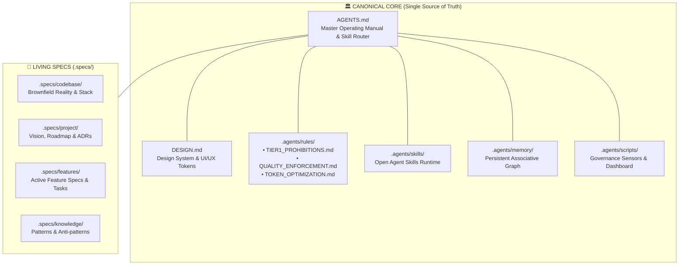
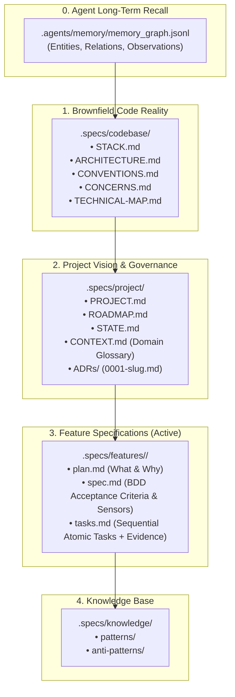
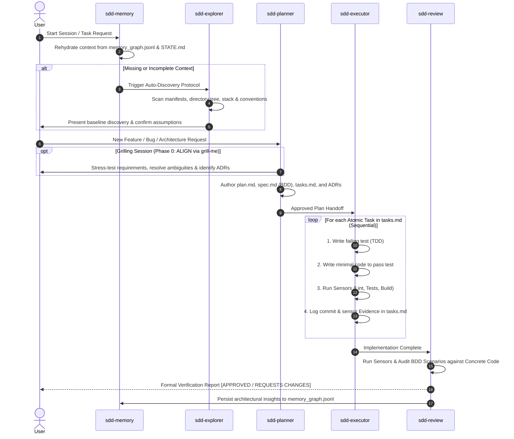

# AI-SDD Framework

> **Spec Driven Development (SDD) Lifecycle, Universal AI Agent Governance & Multi-Harness Skill Runtime**

[](https://opensource.org/licenses/MIT)
[](#-architecture--artifact-topology)
[](#-canonical-governance--standards)
[](#-the-sdd-lifecycle-protocol)
[](DESIGN.md)

---

## 🎯 Overview

**AI-SDD Framework** is an enterprise-grade agentic operating system and governance standard designed to eliminate the fundamental failure modes of AI coding assistants:
- ❌ Hallucinated architectures and broken dependencies.
- ❌ Unverified assumptions and silent code simplification (`// TODO`, stubs, deleted error handling).
- ❌ Context drift across multi-turn sessions and lost decisions.
- ❌ Bypassed test suites (`.skip()`, commented-out assertions, `--no-verify`).
- ❌ Lock-in to proprietary agent ecosystems.

Instead of unconstrained "prompt-and-code" execution, the framework enforces a **strict, deterministic Spec Driven Development lifecycle** governed by file-based persistent state, empirical sensor validation, and open skill standards.

```text
0. sdd-memory   ──► 1. sdd-explorer ──► 2. sdd-planner ──► 3. sdd-executor ──► 4. sdd-review
(Long-Term Recall)  (Brownfield Reality) (Specs & ADRs)     (Atomic TDD Cycle)   (Sensor Audit)
```

---

## 🏛️ Canonical Governance & Standards (AGENTS.md & DESIGN.md)

AI-SDD Framework is **100% harness-agnostic** and operates on a **File-First Single Source of Truth**: all state lives in standard Markdown, JSON Lines, and Mermaid diagrams. 

Rather than maintaining fragmented, tool-specific configuration files, governance, lifecycle enforcement, and UI standards are consolidated into three canonical foundations:

1. **`AGENTS.md`**: Master Operating Manual, Blocking Gates, Execution Rules, and Skill Routing Matrix across all AI agents and assistants.
2. **`DESIGN.md`**: Design tokens, color palettes, typography scales, and UI/UX invariant constraints.
3. **`.agents/`**: Core governance runtime comprising system rules (`.agents/rules/`), persistent memory graph (`.agents/memory/`), automation scripts (`.agents/scripts/`), and specialized skills (`.agents/skills/`).


```mermaid
flowchart TD
    subgraph Core["🏛️ CANONICAL CORE (Single Source of Truth)"]
        AG["AGENTS.md<br/>Master Operating Manual & Skill Router"]
        DESIGN["DESIGN.md<br/>Design System & UI/UX Tokens"]
        RULES[".agents/rules/<br/>• TIER1_PROHIBITIONS.md<br/>• QUALITY_ENFORCEMENT.md<br/>• TOKEN_OPTIMIZATION.md"]
        SKILLS[".agents/skills/<br/>Open Agent Skills Runtime"]
        MEM[".agents/memory/<br/>Persistent Associative Graph"]
        SCRIPTS[".agents/scripts/<br/>Governance Sensors & Dashboard"]
    end

    subgraph Specs["📐 LIVING SPECS (.specs/)"]
        CODEBASE[".specs/codebase/<br/>Brownfield Reality & Stack"]
        PROJECT[".specs/project/<br/>Vision, Roadmap & ADRs"]
        FEATURES[".specs/features/<br/>Active Feature Specs & Tasks"]
        KNOWLEDGE[".specs/knowledge/<br/>Patterns & Anti-patterns"]
    end

    AG --- RULES
    AG --- SKILLS
    AG --- MEM
    AG --- SCRIPTS
    AG --- DESIGN
    AG --- Specs
```

---

## 🏛️ Architecture & Artifact Topology

The framework strictly partitions project state across 5 distinct, decoupled layers:


```mermaid
flowchart TD
    subgraph Layer0["0. Agent Long-Term Recall"]
        MEM[".agents/memory/memory_graph.jsonl<br/>(Entities, Relations, Observations)"]
    end

    subgraph Layer1["1. Brownfield Code Reality"]
        EXP[".specs/codebase/<br/>• STACK.md<br/>• ARCHITECTURE.md<br/>• CONVENTIONS.md<br/>• CONCERNS.md<br/>• TECHNICAL-MAP.md"]
    end

    subgraph Layer2["2. Project Vision & Governance"]
        PRJ[".specs/project/<br/>• PROJECT.md<br/>• ROADMAP.md<br/>• STATE.md<br/>• CONTEXT.md (Domain Glossary)<br/>• ADRs/ (0001-slug.md)"]
    end

    subgraph Layer3["3. Feature Specifications (Active)"]
        FTS[".specs/features/<feature-id>/<br/>• plan.md (What & Why)<br/>• spec.md (BDD Acceptance Criteria & Sensors)<br/>• tasks.md (Sequential Atomic Tasks + Evidence)"]
    end

    subgraph Layer4["4. Knowledge Base"]
        KNW[".specs/knowledge/<br/>• patterns/<br/>• anti-patterns/"]
    end

    MEM --> EXP
    EXP --> PRJ
    PRJ --> FTS
    FTS --> KNW
```

---

## 🔄 The SDD Lifecycle Protocol


```mermaid
sequenceDiagram
    autonumber
    actor User
    participant Memory as sdd-memory
    participant Explorer as sdd-explorer
    participant Planner as sdd-planner
    participant Executor as sdd-executor
    participant Reviewer as sdd-review

    User->>Memory: Start Session / Task Request
    Memory->>Memory: Rehydrate context from memory_graph.jsonl & STATE.md
    
    alt Missing or Incomplete Context
        Memory->>Explorer: Trigger Auto-Discovery Protocol
        Explorer->>Explorer: Scan manifests, directory tree, stack & conventions
        Explorer->>User: Present baseline discovery & confirm assumptions
    end

    User->>Planner: New Feature / Bug / Architecture Request
    opt Grilling Session (Phase 0: ALIGN via grill-me)
        Planner->>User: Stress-test requirements, resolve ambiguities & identify ADRs
    end
    Planner->>Planner: Author plan.md, spec.md (BDD), tasks.md, and ADRs

    Planner->>Executor: Approved Plan Handoff
    loop For each Atomic Task in tasks.md (Sequential)
        Executor->>Executor: 1. Write failing test (TDD)
        Executor->>Executor: 2. Write minimal code to pass test
        Executor->>Executor: 3. Run Sensors (Lint, Tests, Build)
        Executor->>Executor: 4. Log commit & sensor Evidence in tasks.md
    end

    Executor->>Reviewer: Implementation Complete
    Reviewer->>Reviewer: Run Sensors & Audit BDD Scenarios against Concrete Code
    Reviewer-->>User: Formal Verification Report [APPROVED / REQUESTS CHANGES]
    Reviewer->>Memory: Persist architectural insights to memory_graph.jsonl
```

---

## 🎛️ Complete Skills & Capabilities Matrix

All skills follow the **Open Agent Skills Standard** with structured YAML frontmatter, execution workflows, and reference templates:

| Skill | Category | Primary Purpose | Key Artifacts |
| :--- | :--- | :--- | :--- |
| **`sdd-memory`** | `project-codebase-memory` | Cross-session long-term recall & entity graph management | `.agents/memory/memory_graph.jsonl` |
| **`sdd-explorer`** | `project-mapping` | Brownfield discovery, stack mapping & conventions extraction | `.specs/codebase/` (`STACK.md`, `ARCHITECTURE.md`, `CONVENTIONS.md`, `TECHNICAL-MAP.md`) |
| **`sdd-planner`** | `project-planning` | Problem decomposition, BDD specs, atomic tasks & ADR authoring | `.specs/features/<id>/` (`plan.md`, `spec.md`, `tasks.md`), `.specs/project/` |
| **`grill-me`** | `requirement-analysis` | Relentless interview protocol to stress-test requirements (Phase 0) | Direct Q&A → Feeds `sdd-planner` & `CONTEXT.md` |
| **`sdd-executor`** | `development-workflow` | Surgical TDD implementation with sensor evidence & Safety Valve | Source code, test files, `tasks.md` (Evidence column) |
| **`sdd-review`** | `development-workflow` | Sensor-based empirical audit against BDD acceptance criteria | Formal Verification Report with Verdict in chat |
| **`debug`** | `diagnostics` | Zero-guesswork root cause analysis and reproduction | Diagnostic analysis → Feeds `sdd-planner` if replan needed |
| **`refactor`** | `code-quality` | Clean-code transformations with continuous non-regression test sensors | Refactored source code |
| **`search`** | `discovery` | Static symbol lookup, regex search, and call-site tracing | Direct `file:///` line references |
| **`arxiv`** | `research` | Academic paper search, abstract extraction & BibTeX generation | Paper summaries & BibTeX citations |
| **`write-a-skill`** | `meta-skill` | Authoring new agent skills with standard structure and resources | `.agents/skills/<skill-name>/SKILL.md` |

---

## 🛡️ Core Rules & Safety Valves

1. **Research Before Implementing (Zero Guesswork — Tier 1)**:
   > *"Source X does Y at file:line, we do Z, the difference causes W"* is the mandatory threshold. Hypothesizing or blind trial-and-error is rejected.
2. **Zero Shortcuts, Stubs or Simplified Code (Tier 1)**:
   `// TODO`, `// FIXME`, `/* stub */` or simplified mock algorithms are strictly prohibited. Response time is irrelevant — quality and correctness are absolute.
3. **No Test or Hook Bypassing ([QUALITY_ENFORCEMENT.md](.agents/rules/QUALITY_ENFORCEMENT.md))**:
   Never use `.skip()`, `.only()`, `--no-verify`, or `@ts-ignore` to hide failing tests.
4. **Safety Valve Protocol**:
   If an implementation task touches >3 files unexpectedly or hits high-risk legacy boundaries, the executor immediately halts and requests replanning from `sdd-planner`.
5. **Governed Deletions & Git Safety**:
   Destructive git operations (`git reset --hard`, `git push -f`, branch deletions) and project file removals are strictly blocked without human authorization.
6. **Design System Invariance**:
   All frontend and UI components must strictly inherit tokens (colors, typography, spacing, border radii) from [`DESIGN.md`](DESIGN.md).

---

## 📁 Repository Structure

```
ai-sdd-framework/
├── .agents/
│   ├── dashboard/dist/                 # Pre-compiled production Vue 3 Cockpit SPA assets
│   ├── memory/
│   │   └── memory_graph.jsonl          # Cross-session persistent knowledge graph
│   ├── rules/                          # Non-negotiable system rules (Highest Precedence)
│   │   ├── TIER1_PROHIBITIONS.md       # Prohibitions: No shortcuts, No destructive git, Sequential order, ACI, Test & ADR Immutability
│   │   ├── QUALITY_ENFORCEMENT.md      # Test & hook bypass bans, scratchpad isolation, Spec Drift invariance
│   │   └── TOKEN_OPTIMIZATION.md       # Calibrated output verbosity per model tier
│   ├── scripts/                        # Governance, server & sensor scripts (Zero-Dependency)
│   │   ├── serve-dashboard.js          # Native HTTP & RFC 6455 WebSocket gateway & 360° Living Specs API
│   │   ├── export-docs.js              # Standalone single-file HTML documentation compiler
│   │   ├── verify-sdd-integrity.js     # SDD Canonical Integrity & Schema Sensor
│   │   ├── check-spec-drift.js         # Pre-commit Spec Drift Sensor (Constitutional SDD)
│   │   ├── compact-memory.js           # Memory graph maintenance & compaction
│   │   └── install-hooks.js            # Git pre-commit hook installer
│   └── skills/                         # Specialized Agent Skills & Protocols (Open Format)
│       ├── sdd-memory/                 # Long-term recall & graph maintenance
│       ├── sdd-explorer/               # Codebase discovery & technical mapping
│       ├── sdd-planner/                # Problem decomposition, specs & ADR authoring
│       ├── sdd-executor/               # Atomic TDD implementation with sensor evidence
│       ├── sdd-review/                 # Sensor-based empirical verification & scoring
│       ├── grill-me/                   # Interactive decision tree stress-testing (Phase 0)
│       ├── debug/                      # Root cause analysis & reproduction
│       ├── refactor/                   # Clean-code structural improvements
│       ├── search/                     # Targeted symbol, regex & pattern lookup
│       ├── arxiv/                      # Academic paper extraction & BibTeX generation
│       └── write-a-skill/              # Meta-skill for authoring new agent skills
├── .specs/                             # Living Specifications (Created per project)
│   ├── codebase/                       # Physical code architecture & stack maps (STACK, ARCHITECTURE, CONVENTIONS, CONCERNS, TECHNICAL-MAP)
│   ├── project/                        # Product vision, roadmap, session state & ADRs (PROJECT, ROADMAP, STATE, CONTEXT, ADRs/)
│   ├── features/                       # Active feature specifications (modular-vue-cockpit, living-html-docs)
│   └── knowledge/                      # Curated patterns and anti-patterns
├── docs/                               # Exported Standalone Living Documentation
│   └── index.html                      # Single-file offline documentation (100% serverless)
├── packages/
│   └── dashboard/                      # Modular Vue 3 + Vite + Tailwind source code for Cockpit UI
├── tests/
│   ├── serve-dashboard.test.js         # Server & Living Docs API test suite (19 unit & integration tests)
│   └── export-docs.test.js             # Standalone static exporter test suite (2 tests)
├── .cursorrules                        # Universal Cursor AI directive referencing AGENTS.md
├── .windsurfrules                      # Universal Windsurf AI directive referencing AGENTS.md
├── .clinerules                         # Universal Cline / RooCode directive referencing AGENTS.md
├── .github/
│   └── copilot-instructions.md         # GitHub Copilot instructions referencing AGENTS.md
├── AGENTS.md                           # 🏛️ Master Operating Manual & Skill Routing Matrix
├── DESIGN.md                           # 🎨 Linear-inspired Design Tokens & UI Specification
└── README.md                           # Official Documentation
```

---

## 🚀 Quickstart: Bootstrapping a Project

### 1. Integrate into your workspace
Copy the `.agents/`, `AGENTS.md`, and `DESIGN.md` into the root of your project:

```bash
cp -r .agents/ AGENTS.md DESIGN.md /path/to/your/project/
```

> **Zero Host Pollution**: Host projects require **zero npm dependencies**. The server runtime (`serve-dashboard.js`) and governance sensors run purely on native Node.js standard libraries (`http`, `fs`, `crypto`, `child_process`).

### 2. Auto-Discovery Protocol
Start your AI session in any supported tool. The agent will execute the **Blocking Gate**:
1. Check `.agents/memory/memory_graph.jsonl` for past session memory.
2. If `.specs/project/CONTEXT.md` is empty or missing, it triggers **Auto-Discovery** (scans package manifests, directory trees, configs, and coding conventions).
3. Generates the initial codebase map in `.specs/codebase/` and confirms domain assumptions with you.

### 3. Build Features with SDD
Request a new feature:
```text
"Planeje a feature de autenticação JWT com refresh token seguindo o SDD."
```
The agent will execute:
1. `sdd-planner` (with `grill-me`) → drafts `plan.md`, `spec.md` with BDD scenarios, and atomic `tasks.md`.
2. `sdd-executor` → implements sequentially via TDD, logging sensor evidence.
3. `sdd-review` → audits sensors (lint, test, build) and generates a formal Verification Report.

### 4. Interactive Human-AI Cockpit & Universal Living Docs
Launch the Cockpit web workspace (Vue 3 SPA + Embedded Terminal):

```bash
npm run dashboard
# Or directly with zero dependencies:
node .agents/scripts/serve-dashboard.js
```

Open [http://localhost:3000](http://localhost:3000) to access:

- **📚 Universal Living HTML Documentation (360° Specs Projection)**:
  - **🏛️ Architecture & System Map**: Renders `STACK.md`, `ARCHITECTURE.md`, `CONVENTIONS.md`, and **dynamic in-browser Mermaid diagrams** from ````mermaid code blocks.
  - **📜 ADR Decision Hub**: Interactive timeline of all Architectural Decision Records with status filtering (`Accepted`, `Superseded`, `Proposed`) and cross-impact tracking.
  - **📖 Domain & Vision**: Instant search across ubiquitous domain terms in `CONTEXT.md`, executive vision (`PROJECT.md`), and strategic milestones (`ROADMAP.md`).
  - **🛡️ Governance & Rules**: Visual reference for Tier 1 Absolute Prohibitions, Quality Enforcement, and Token Optimization.
  - **🧠 Knowledge Base**: Curated architectural patterns and anti-patterns.
- **📋 Interactive Human-AI Kanban**:
  - Drag-and-drop tasks or use quick-action menus with **two-way git sync** directly to physical `.specs/features/<id>/tasks.md`.
  - **Review & Quality Rejection**: Moving a card back from Done prompts for structured review feedback, automatically recorded in Markdown for the agent to fix.
  - **Agent Dispatcher**: 1-click `[⚡ Delegar]` button that generates task-specific context prompts and copies them to the clipboard or terminal.
- ** cascaded Feature Specifications**:
  - Vertical cascade from Problem Statements to User Stories (Role/Action/Benefit), BDD Criteria (Given/When/Then), and MetaGPT atomic task tables.
- **🧠 Interactive Memory Graph**:
  - Force-directed network diagram (`vis-network`) visualizing all entities, relationships, and observations from `memory_graph.jsonl` with an interactive side inspector drawer.
- **💻 Embedded Terminal Drawer (`xterm.js`)**:
  - Openable via header badge or shortcut (`Ctrl+\`` / `Cmd+\``).
  - Connected to native PowerShell on Windows (with UTF-8 Nerd Font rendering) or Bash on POSIX.
  - Interactive line discipline with real-time typing echo, Backspace, command history (↑ / ↓), and 1-click sensor buttons (`[🔍 Drift Check]`, `[🧪 npm test]`).

### 5. Standalone Zero-Server Documentation Export
Compile the entire specification and governance tree into a standalone, single-file HTML document for offline review or static hosting (e.g. GitHub Pages):

```bash
npm run docs:export
```
Emits **`docs/index.html`** (~85 KB) with embedded CSS, client-side search, tabs, and rendered Mermaid diagrams—100% functional offline without Node.js.

### Useful Framework Scripts

| Command | Purpose |
| :--- | :--- |
| `npm run dashboard` | Starts the native Cockpit server on port 3000 with real-time SSE live-sync |
| `npm test` | Runs the 21-test sensor suite preceded by the SDD Canonical Integrity Sensor |
| `npm run verify-sdd` | Fast (<50ms) sensor auditing required canonical files, ADR statuses, schemas, and escape integrity |
| `npm run docs:export` | Compiles 100% of `.specs/` and rules into a standalone offline `docs/index.html` |
| `npm run check-drift` | Pre-commit Spec Drift Sensor validating staged git code against active `tasks.md` |
| `npm run build:dashboard` | Recompiles the Vue 3 frontend from `packages/dashboard/` into `.agents/dashboard/dist/` |
| `npm run compact-memory` | Compacts and resolves superseded entities in `memory_graph.jsonl` |

---

## 📄 License

This project is licensed under the [MIT License](LICENSE).

